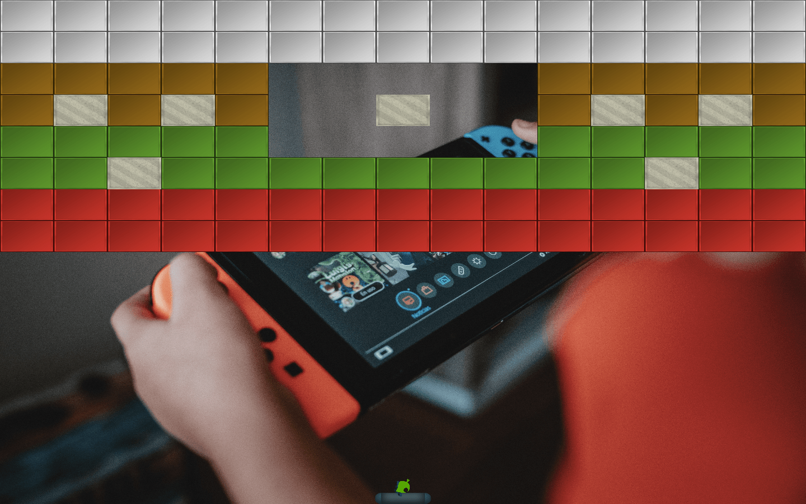

<p align="center">

</p>

### environment

MacOS

### compile

1. install GLFW  
https://maxyoung.fun/blog/OpenGL%E7%8E%AF%E5%A2%83%E9%85%8D%E7%BD%AE.html#glfw

2. install irrKlang  
https://maxyoung.fun/blog/OpenGL%E7%8E%AF%E5%A2%83%E9%85%8D%E7%BD%AE.html#irrklang-sound-effect-library

3. compile  
    ```shell
    $ cd build
    $ make
    ```

4. run  
    ```shell
    $ ./MaxGame
    ```

### Manual

KEY_LEFT: move left  
KEY_RIGHT: move right  
KEY_SPACE: emission
